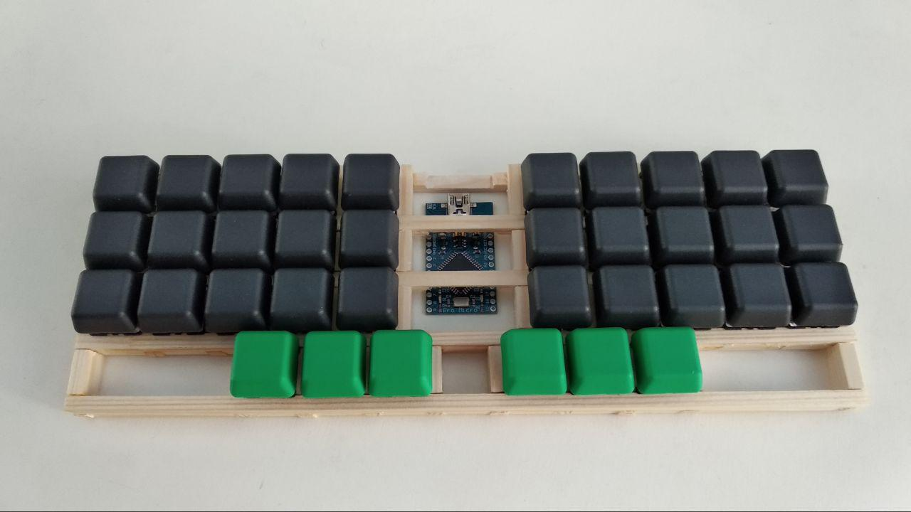

# Немного о здешних клавиатурах

Представленные здесь клавиатуры уже полностью работают.

<table>

<tr><td>
<h2>Кошкоклава</h2>
Была создана в 2012. 

Есть статья на хабре: `https://habr.com/post/185500/`

Впоследствии стало ясно, что кнопок многовато, поэтому пришли к концепции кошки без некоторых клавиш, а затем к Коденецу.

`Github:` `github.com/ibnteo/catboard`
</td><td>

</td></tr>
<tr><td>
<h2>Коденец</h2>
  
Коденец - переходная форма между кошкоклавой и кладенцом. Здесь используются как `аккорды`, так и обычные нажатия клавиш.

</td><td>

</td></tr>
<tr><td>
<h2>Кладенец</h2>

Клавиатура, построенная полностью на концепции аккордов. `Аккорд` — одновременное нажатие нескольких клавиш, создающее символ, слог или даже слово. Довольно революционное решение. Вдохновлён steno.

**Главные фичи:**
* Можно работать одной рукой, клавиатура полностью симметричная.
* По этой же причине можно добиться полного чередования между руками.
* Намного меньше клавиш.

`Github и описание:` `github.com/ibnteo/kladenets`
</td><td>

</td></tr>

<tr><td>
<h2>Приклад</h2>
Клавиатура с 10 кнопками на основе Кладенца, соданная для набора на телефоне, планшете.

</td><td>

</td></tr>

</table>

# Хочу!

У нас открыты предзаказы, если наберётся достаточно людей, то мы можем заказать производство первых копий на ЧПУ, цена будет близка к себестоимости. Ссылка: [kbd.klava.org](http://kbd.klava.org)
